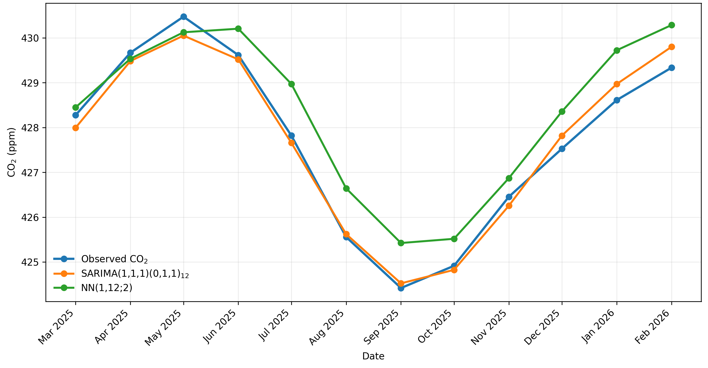
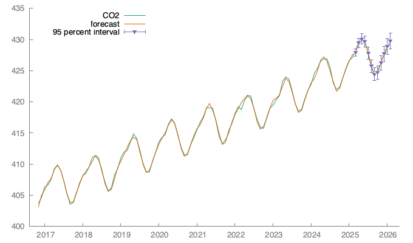

# Forecasting Atmospheric CO₂ Concentrations Using SARIMA and Neural Networks

This project was developed as part of my Master's thesis in Mathematical Engineering.

The aim of the project is to compare two approaches to forecasting monthly atmospheric CO₂ concentrations measured at Mauna Loa:

- a classical statistical model — SARIMA,
- an autoregressive feed-forward neural network.

## Dataset

The analysis uses monthly atmospheric CO₂ concentration data from Mauna Loa.

The time series begins in 1958 and is expressed in parts per million (ppm).

For model evaluation, the data were divided into training, validation, and test periods while preserving their chronological order.

## Models

### SARIMA

The selected statistical model was:

**SARIMA(1,1,1)(0,1,1)₁₂**

The model includes both non-seasonal and seasonal differencing and accounts for the annual seasonality of monthly CO₂ observations.

The SARIMA analysis was performed using Gretl.

### Autoregressive Neural Network

The neural network uses lagged CO₂ observations as predictors.

The selected architecture was:

**NN(1,12;2)**

The model was implemented in Python using `MLPRegressor` from scikit-learn.

## Forecast Comparison

The figure below compares the observed monthly CO₂ concentrations with the 12-month dynamic forecasts produced by the selected SARIMA and neural network models.



## Final Test Results

The models were evaluated on a 12-month out-of-sample test period from March 2025 to February 2026.

| Model | RMSE (ppm) | MAE (ppm) | MAPE |
|---|---:|---:|---:|
| SARIMA | 0.244 | 0.212 | 0.0495% |
| Neural Network | 0.794 | 0.705 | 0.165% |

On this test period, SARIMA produced lower forecast errors than the neural network.

These results refer to this particular CO₂ time series and test period and should not be interpreted as evidence of general superiority of one forecasting method over another.

## SARIMA Forecast and Prediction Intervals

The selected SARIMA model was also used to generate a 12-month dynamic forecast with 95% prediction intervals.

As the forecast horizon increases, the prediction intervals widen, reflecting the increasing uncertainty associated with longer-term forecasts.



## Repository Structure

```text
co2-time-series-forecasting/
├── data/
│   ├── co2_mm_mlo.txt
│   └── co2_gretl_single_column.csv
├── gretl/
│   └── CO2_GRETL.gretl
├── notebooks/
│   └── neural_network.ipynb
├── .gitignore
├── requirements.txt
└── README.md
```

## Python Requirements

The Python part of the project uses:

- NumPy
- pandas
- Matplotlib
- scikit-learn
- Jupyter

Install the required packages with:

```bash
pip install -r requirements.txt
```

## Running the Neural Network Analysis

Clone the repository, install the required Python packages, and open:

```text
notebooks/neural_network.ipynb
```

The notebook reads the CO₂ dataset from the `data` directory.

## Tools and Technologies

- Python
- Jupyter Notebook
- pandas
- NumPy
- scikit-learn
- Matplotlib
- Gretl

## Author

**Sandra Ciupa**